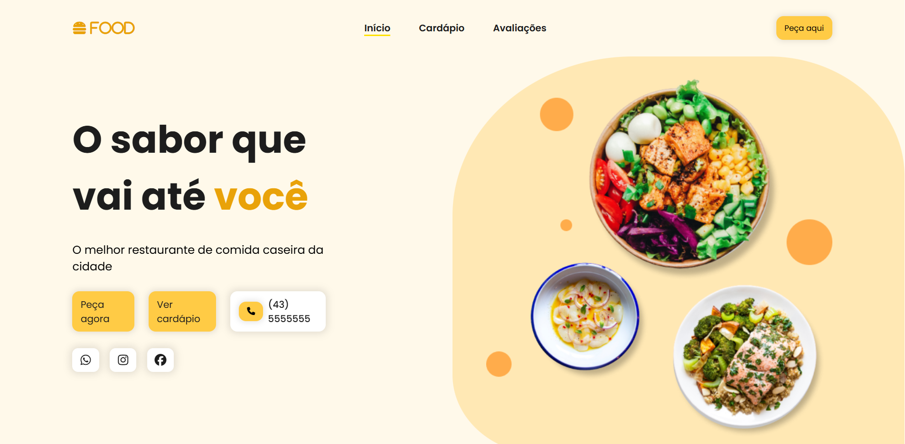
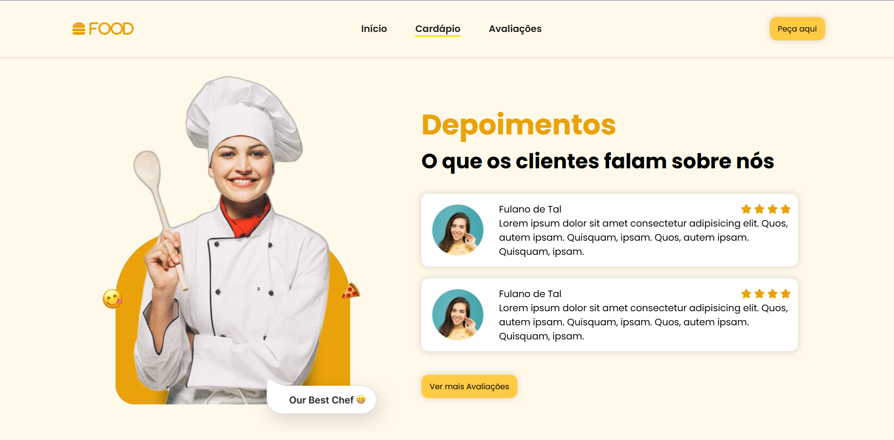

# ✨ Projeto: Landing Page Responsiva e Animada

Projeto feito pela Larissa Kich.

Este projeto consiste em uma **Landing Page moderna, responsiva e com animações suaves**, construída com **HTML5, CSS3** e **JavaScript (utilizando jQuery)**. A página foi desenvolvida com foco em **atrair usuários, apresentar um produto ou serviço de forma eficaz** e garantir **ótima experiência em diferentes dispositivos**.

---

## 📸 Imagem de Prévia





---

## 🧩 Funcionalidades

- Layout **100% responsivo** (mobile-first)
- Animações de **scroll suave** e elementos com `fade`, `slide`, etc.
- **Menu fixo** com rolagem suave para seções
- Botões com **efeito hover animado**
- Sessão de **formulário de contato funcional**
- **ScrollReveal**, efeitos com jQuery e interações modernas

---

## 🛠️ Tecnologias Utilizadas

### 🖥️ Frontend


---

## 📂 Estrutura do Projeto

```
landing-page/
├── index.html # Estrutura da página
├── src/
│ ├── javascript # Interações com jQuery
| ├── styles # Estilos e responsividade
│ └── img # Imagens utilizados
└── README.md # Documentação
```

---

## 📱 Responsividade

O layout se adapta perfeitamente a:

- Smartphones (320px+)
- Tablets
- Notebooks
- Monitores widescreen

Utilizando **media queries** e técnicas de **flexbox/grid**, os elementos se reorganizam para melhor usabilidade em qualquer tamanho de tela.

---

## 🔍 Animações e Interações

As animações foram criadas com **jQuery e CSS**:

- Efeitos `fadeIn`, `slideDown` e `scrollReveal` nos elementos
- Animações ao rolar a página
- Suavidade no clique dos botões
- Destaque visual para menus ativos

---

## 🧠 Aprendizados

- Design responsivo com CSS Grid e Flexbox
- Animações suaves com jQuery
- Organização de código para escalabilidade
- Boas práticas de HTML semântico e acessível
- Estruturação visual para experiência de usuário (UX/UI)

---

## 📜 Licença

Este projeto está sob a **Licença MIT** – sinta-se à vontade para copiar, modificar ou distribuir com os devidos créditos.

---

## 🙋‍♀️ Autor

Feito com 💙 por [Natiele Nogueira]  
Projeto desenvolvido para fins de estudo em desenvolvimento front-end moderno.

---